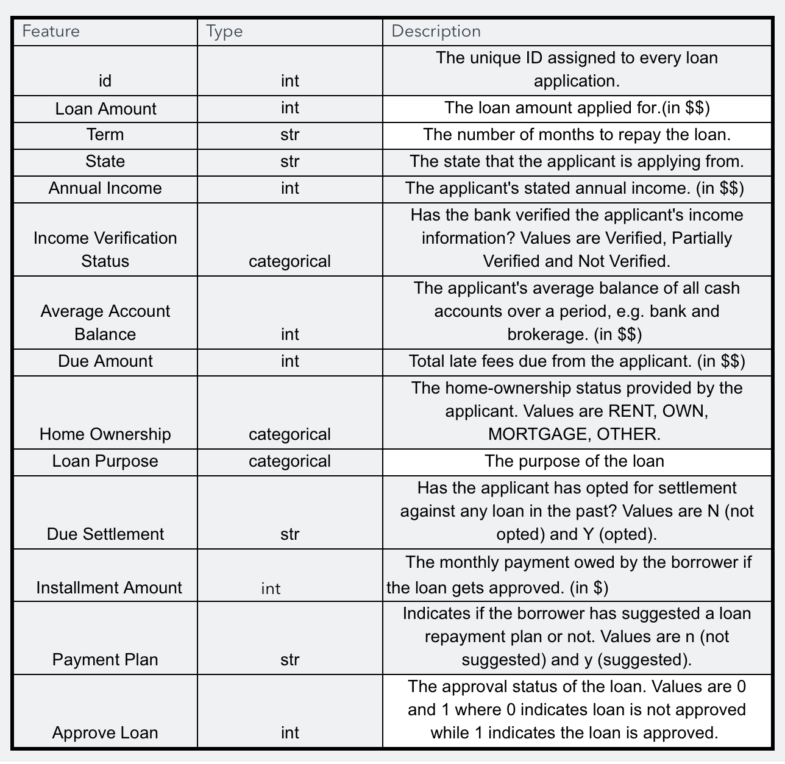

```{r, include=FALSE}
knitr::opts_chunk$set(message = FALSE, warning=FALSE)
```

```{css, echo=FALSE}
[alt=acme] {
  border-radius: 10px;
  margin-left: auto;
  margin-right: auto;
  border: solid 1px #CCC;
    -moz-box-shadow: 5px 5px 0px #999;
    -webkit-box-shadow: 5px 5px 0px #999;
        box-shadow: 5px 5px 0px #999;
}
```
<center>

</center>
## Disclaimer

```{r, include=FALSE}
suppressPackageStartupMessages(library(tidyverse, warn.conflicts = FALSE))
suppressPackageStartupMessages(library(tidymodels))
```
The following Document intends to guide you through all the different steps needed to build a Machine Learning Model using R. It is necessary to have all of the following packages installed in order to reproduce this Document correctly:

 * `tidyverse`
    - `dplyr`
    - `purrr`
    - `tibbles`
    - `readr`
    - `ggplot2`
    - `forcats`
 * `rlang`
 * `tidymodels`
    - `recipes`
    - `rsample`
    - `yardstick`
    - `parsnip`
    - `corrr`
 * `janitor`
 * `ranger`

## Reproducibility

In order to make any random process reproducible in R a random seed will be set:

```{r}
set.seed(471)
```

# The Problem

ACME bank needs to develop a Loan Evaluation Model with the following dataset that has been already assessed and includes variables such as Loan Amount, Customer Living State, Average Account Balance, annual salary, among others.

The request consists in developing a prediction model capable of determining if a Loan needs to be approved or not.

The analysis result should contain a detailed solution, data visualizations, the thinking process and the features and inferences taken from the model, in a friendly language for people not necessarily related to the Data Science field.

# Importing Data

The first thing to do will be Importing the Data needed for building the model.
Due to having .csv files to be read, the `readr` package is the one offering the best performance and sanity to read the files:

```{r, results='hide'}
library(readr)
#Assigning Train set
train <- read_csv("train.csv")
#Assigning Test Set
test <- read_csv("test.csv")
```
# Cleaning Names

Variable names like **Approve Loan** can cause some conflicts in the future. In order to get the best quality work without run into issues with function compatibility the `janitor` package will be used to clean up names into snake_case.

New names shown below:
```{r}
library(janitor, warn.conflicts = FALSE)
train <- train %>%
  clean_names()

test <- test %>%
  clean_names()

names(train)
```

# Exploring the Data

In order to understand the Problem, Exploratory Analysis will be conducted. This means, doing some research to understand what is the data about. This is done by Statistical Analysis and sometimes by Visual Inspection.


14 Variables have been detected in the data, having 7 Character Variables and 7 numerical variables
```{r}
train %>%
  map_df(class) %>%
  pivot_longer(everything(),names_to = "Variables") %>%
  count(value)

```

In order to understand the data properly is necessary to also understand the Metadata. This was provided by the stakeholder in a .png file.



Metadata provides explanations on Variable Names, Data Types, and a brief description on what that variable means.

Normally when it comes to modeling, character variables are considered categories. In R these need to be handled as factors. Plus, the Target variable **Approve Loan** is set as an Integer, so it needs to be converted into factor as well.

This can be confirmed by checking the Metadata.

```{r}
#Converting Character Variables into Fators
train <- train %>%
  mutate_if(is.character, factor) %>%
  mutate_at(vars("approve_loan"), factor)

# Re labeling 1 and 0 into Approve Not_Approve
train$approve_loan <-train$approve_loan %>%
  fct_recode(Approved = "1", Not_Approved = "0")

train
```

Once the proper data Types are in place is necessary to analize every variable.

> The Test set needs to be modified the same way the Training set was to avoid compatibility issues when predicting.

```{r}
test <- test %>%
  mutate_if(is.character, factor) 

test

```


## Analizing Categorical Variables

`tabyl()` allows to Show the number of occurrences by Category in every Variable. It also shows the occurrence percentage of the data and valid percentage, that is to say, excluding missing Values (NA).

```{r}
library(janitor)
train %>%
  select_if(is.factor) %>%
  map(~ .x  %>% tabyl)
```

Using a more Visual approach:

```{r}
train %>%
  select_if(is.factor) %>%
  walk2(names(.), ~ print( train %>%
                             ggplot(aes(.x)) + geom_bar() + labs(x = .y))) 
```

## Categorical Variable Analysis Conclusions

* It can be seen the different Variable distributions and what is their trend in terms of their internal categories.

* Missing Values have been detected in some of the variables. Since the amount of NAs are low, they can be imputed, meaning they will filled by simulated techniques such as:

 * Mode: Filling with the Most Frequent Category.
 * Bag Impute: Using Bag Trees, another Model Layer to Impute Missing Data.
 * Using the Category that makes sense the most: For example when *OTHER* Categories are available.

* **Term** Variable seems to be quite biased to 36 Months and a small amount of Missing Data (2.3%), NAs will be imputed using Mode Imputation. 

* **State** Variable has 49 different States. All the records are correctly populated. No imputation needed. 

* **Income Verification Status** looks well balanced, having less than 1% missing. A Bag Impute will be conducted here.

* **Home Ownership** doesn´t fit exactly to the values provided in the Metadata. NA values will be set as *OTHER* according to Metadata.

* **Loan Purpose** looks imbalanced towards *debt_consolidation*  but is correctly populated. No imputation needed here.

* **Due Settlement** looks well balanced and bag Imputation will be conducted here (5.6% Missing).

* **Payment Plan** looks highly imbalanced, not including any record having the option *Suggested Loan Repayment*. In this case this variable is not informative and it will be dropped.

* **Approve Loan** is correctly populated and no imputation is needed.

### Home Ownership Correction

**Train Set:**
```{r}
# Change ANY to OTHER according to Metadata
train$home_ownership <- train$home_ownership %>% fct_recode(OTHER = "ANY")
# Replace Missing Values to NA
train$home_ownership <- train$home_ownership %>% replace_na("OTHER")
```
The Other Imputation Steps will be conducted during the Pre-Processing.

**Test Set**

```{r}
# Change ANY to OTHER according to Metadata
test$home_ownership <- test$home_ownership %>% fct_recode(OTHER = "ANY")
# Replace Missing Values to NA
test$home_ownership <- test$home_ownership %>% replace_na("OTHER")
```


## Analizing Numerical Variables

In order to analyze Numerical Distribution the `summary()` function offers a quantile distribution plus the amount of Missing Data within every variable.

```{r}
train %>%
  select_if(is.numeric) %>%
  summary()
```

Using a more Visual approach

```{r, warning=FALSE, message=FALSE}
train %>%
  select_if(is.numeric) %>%
  walk2(names(.), ~ print( train %>%
                             ggplot(aes(.x)) + geom_histogram() + labs(x = .y))) 
```

## Numerical Variable Analysis Conclusions

* All Numerical Variables are Positive Integers Values.

* Missing Values have been detected in all of the variables. Since the amount of NAs are low, they can be imputed, meaning they will filled by simulated techniques such as:

 * KNN: Short for K Nearest Neighbour, a Model Layer to Impute Values based on the records that are surrounding the Missing Data.
 
* Some of the data is highly Right-Skewed, meaning the data is Highly concentrated to the left forming a long Tail to the Right. This needs to be treated using in this case a Box-Cox Transformation that is suitable for Positive Values Distributions.

* **ID** is just an Identifier and makes no sense to analyze their distribution. It will be dropped from the model since it is not contributing information to the model.

* **Loan Amount** is well distributed and includes 94 missing Values, this will be imputed using KNN.

* **Annual Income** is Right-Skewed and will be treated using Box-Cox Transformation. It will be also imputed with KNN since it has 72 missing values.

* **Average Account Balance** is also Right-Skewed and has 106 missing values. Box Cox transformation and KNN will be conducted on it.

* **Due Amount** is also highly Right-Skewed and has 41 missing values that will be imputed with KNN.

* **Installment Amount** is the last variable, also fairly well distributed. Only KNN will be conducted to impute its 16 missing values.


# Checking Numerical Correlations

It is important to check highly correlated variables that can mess up the model. High Correlation means that 2 Variable are linked together and have a relationship between them. This can affect negatively the model so it is necessary to treat them properly.

In order to do that the data will be analized using the `corrr` package.
```{r}
library(corrr)
train %>%
  select_if(is.numeric) %>%
  correlate() %>%
  shave() %>%
  fashion(decimals = 3)
```

From here it can be seen that Installment Amount is highly correlated to the Loan Amount (96.1%). This is expected since the bigger the Loan Amount the higher the Installment.
In order to deal with this a new feature can be created by using a Ratio between Installment Amount and Loan Amount.

```{r}
train <- train %>%
  mutate(installment_loan_ratio = installment_amount / loan_amount)
```

Checking the New Correlations one the new Ratio Variable has been created: 

```{r}
train %>%
  select_if(is.numeric) %>%
  select(-installment_amount, -loan_amount) %>%
  correlate() %>%
  shave() %>%
  fashion(decimals = 3)
  
```

Now all of the correlations are below the 50% threshold.

# Checking Categorical Interactions

When it comes to Categorical Variables is important to understand whether they are related or not to the Target. One way to understand if this relationship exists is by using Cross Tables and chi-square test.

chi-square tests if two variables are Independent ( in this case Target and one Predictor) or not providing a p-value. If p-value is greater than 0.05 one can safely say the two variables are independent, with no relationship between them and the predictor can be discarded.

```{r}
#Creating a tidy function using curly-curly 
library(rlang)
check_tabyl <- function(variable) {
  train %>%
    select_if(is.factor) %>%
    tabyl(approve_loan, {{ variable }})
  
}

#Creating a name list of the Categorical Variables
df_names <- train %>%
  select_if(is.factor) %>%
  select(-approve_loan) %>%
  names()

# Using Mapping categorical Variable names to a chi-square test.
df_names %>%
  map_dbl( ~ check_tabyl(!!sym(.x)) %>%
             chisq.test() %>% pluck("p.value")) %>%
  enframe() %>%
  bind_cols(var_names = df_names) %>%
  filter(value > 0.05)
 
```

After this analysis, **State** and **Payment Plan** delivered a chi-square test p-value greater than 0.05, meaning the null hypohesis failed to be rejected, meaning they can be considered Independent to the Target Variable. 

Having these results mean that there is no relationship between them and the Target Variable, hence they are not contributing to the prediction, hence they can be dropped.

**Payment Plan** had already been dropped since it was considered not to be informative, but this test confirms the previous decision.

# Data Pre-Processing

Data Pre-Processing is the step during Model Building when the data is arranged in a way the model can benefit the most to improve performance. This step depends on the Model that is intended to be built.

R handles this by creating recipes, and a lot of different steps can be put on top this recipe. In this case the steps applied are the necessary to run a Random Forest Model.

The decision is basically made based on my experience since it is a Powerful Model that is not very affected by Overfitting that is something I would like to Control since I have a dataset I cannot measure.

The recipe will include:

  * training_recipe: non-Informative Variable Removal, Imputations, Feature Engineering (Ratio Variables), Skewness Transformations. This type of Recipe will be used for Tree Based Models, In this case I´ll run a Random Forest

```{r}
library(recipes)
training_recipe <- train %>%
  # Creating Recipe, approve_loan will be predicted using all the rest of the variables.
  recipe(approve_loan ~ .) %>%
  # Variables removed because of lack of Information.
  step_rm(id, payment_plan, state, installment_loan_ratio) %>%
  # Imputing Categorical Variables by using 10 trees.
  step_bagimpute(income_verification_status, due_settlement, trees = 10) %>%
  # Imputing using Mode.
  step_modeimpute(term) %>%
  # Imputing Numeric Variables.
  step_knnimpute(
    loan_amount,
    annual_income,
    average_account_balance,
    due_amount,
    installment_amount
  ) %>% 
  # Creating Ratio Variable.
  step_ratio(installment_amount, denom = denom_vars(loan_amount)) %>%
  # Dropping Variables used in the Ratio.
  step_rm(installment_amount, loan_amount) %>%
  # Fixing Skewness issues.
  step_BoxCox(annual_income, average_account_balance, due_amount) %>%
  prep(training = train)
  
# Extract Processed Dataset
trained_df <- juice(training_recipe, everything())

  
```

Finally the trained Pre-Process created with the Training Data needs also to be applied to the Test Data.

```{r}
test_df <- bake(training_recipe, new_data = test)
```

# Building Models

The final Step will be building the model to Predict the desired Target Variable, in this case, if the Loan will be approved or not. The `parsnip` package will be used to build the model.

## Data Split

I´ll be using a strategy 70/30 to split the data into train and validation.

```{r}
library(rsample)
# Normal Pre-Proc
split <- initial_split(trained_df, prop = 0.7, strata = "approve_loan")
```


```{r}
train_split <- training(split)
validation_split <- testing(split)
```

## Building the Random Forest Model

```{r}
#Random Forest Implementation
library(ranger)
# Common ML API
library(parsnip)
rf_model <- rand_forest(mode = "classification", trees = 100) %>%
  set_engine("ranger") %>%
  fit(approve_loan ~ ., data = train_split)
```

```{r}
#Predicting Classes
class_pred <- rf_model %>%
  predict(validation_split, type = "class")
```

```{r}
#Predicting Probability for Positive Class
class_prob <- rf_model %>%
  predict(validation_split, type = "prob")
```

```{r}
#Combining everything into just one Table
comparison_test <- bind_cols(
  "Real" = validation_split$approve_loan,
  "Prediction" = class_pred,
  "Class1" = class_prob$.pred_Approved
  
) %>% setNames(c("Real","Prediction","Prob_Approved"))
```

## Measuring Random Forest Performance

The first way to measure Model quality is through the Confusion Matrix.
```{r}
library(yardstick)
# 'Approved' as the Event Class
options(yardstick.event_first = FALSE)
(confusion <- comparison_test %>%
  conf_mat(Real,Prediction))

```

It can be seen that only 1 False Positive Value and 4 False Negative Values were obtained. Below a set of different Metrics to measure Model Performance

```{r}
confusion %>%
  summary() %>%
  filter(.metric %in% c(
    "accuracy",
    "sens",
    "spec",
    "precision",
    "recall",
    "bal_accuracy"
  ))
```

* Accuracy provides a really high Value which could indicate presence of Overfitting. This means the model can have problems to generalize well in unseen data. It will be necessary to apply a Cross-Validation Technique to make sure this does not happen.

* Sensitivity measures the capability of the Model to Predict correctly the Positive Event, in this case approve a Loan 98.7 % Really good value.

* 99% of Specificity measures the Quality of the Model to predict the Negative Event, in this case reject a Loan. For this problem this is quite good since the Bank doesn´t want to approve Loans to people that actually don´t meet the conditions, since this can lead to delinquent clients.

* The balance accuracy is the Average Between Sensitivity and Specificity to calculate a weighted performance between the Positive and Negative Capacity to Predict.

* Precision means the percentage of the results which are relevant, regarding the positive class.

* Recall refers to the percentage of total relevant results correctly classified by the model, regarding the Positive Class.

### ROC Curve

The ROC curve offers values os Sensitivity and Specifity for every cut-off value. The greater the Area under the curve is (AUC ~ 1), the optimal is the model.

```{r}
comparison_test %>%
  roc_curve(Real,Prob_Approved) %>%
    autoplot()
```


In this Case AUC is pretty high which says the optimal will deliver good results no matter which cut-off value we choose.

```{r}
comparison_test %>%
  roc_auc(Real,Prob_Approved) 
```

## Random Forest Cross Validation

In order to check Model Stability against Overfitting a Cross Validation Process will be conducted.
In this case the whole Training set will be separated into folds for Training and assessment that will be changing to avoid split dependency and obtaining a good model just by chance.


10-fold Cross Validation:

```{r}
library(rsample)
cv_rf <- vfold_cv(trained_df, v = 10, repeats = 1)
```


```{r}
#Running the Model and Calulating Prediction for every Fold.
cv_rf_result <- cv_rf %>%
  mutate(
    model = splits %>%
      map(
        ~ rand_forest(mode = "classification", trees = 100) %>%
          set_engine("ranger") %>%
          fit(approve_loan ~ ., data = analysis(.x))
      ),
    class_prediction = splits %>%
      map2(model,  ~ .y %>%
             predict(
               new_data = assessment(.x), type = "class"
             )),
    prob_prediction = splits %>%
      map2(model,  ~ .y %>%
             predict(
               new_data = assessment(.x), type = "prob"
             ))
  )
```

```{r}
# Compiling Predictions
cv_rf_metrics <- list(cv_rf_result$splits,
            cv_rf_result$class_prediction,
            cv_rf_result$prob_prediction) %>%
  pmap(
    ~ bind_cols(assessment(..1), ..2, ..3)  %>%
      select(approve_loan, .pred_class, .pred_Approved) %>%
      set_names(c("Real", "Prediction", "Prob_Approved"))
  )
```


```{r}
#Analizing Confusion Matrix by Fold
cv_rf_metrics %>%
  map( ~ .x  %>%
  conf_mat(Real, Prediction))

```

```{r}
#Calculating Metrics for every fold.
cv_rf_metrics %>%
  map( ~ .x  %>%
  conf_mat(Real, Prediction) %>%
  summary() %>%
  filter(.metric %in% c(
    "accuracy",
    "sens",
    "spec",
    "precision",
    "recall",
    "bal_accuracy"
  )))

```

* After checking the Metrics of every Fold it can be seen that the Model generalizes pretty well in different Samples taken from the Training Data maintaining high values in all of the metrics of Importance.

* It can also be checked below that the ROC AUC also gives high values for all of he folds, confirming the quality of the model.

```{r}
cv_rf_metrics %>%
  map_dfr( ~ .x  %>%
  roc_auc(Real, Prob_Approved))
```

## Conclusions

* It can be seen that pretty robust model has been built.
* After Feature Engineering and Pre-Procesing the final Model ended up with the following Variables:

```{r}
trained_df %>%
  names()
```

* Random Forest is a pretty powerful model against Overfitting. It was obtained a pretty high Accuracy and AUC values which can be a warning against Overfitting especially when trying in the Test Data that has never been seen before.

* To combat overfitting a Cross Validation technique has been applied. With this technique, the training set has been divided into 10 folds and 1 of them is using as validation whereas the other 9 are used to train the model. This is to avoid the problem of getting a good model just by chance.

# Building the final Model

The final Model will be built using the whole data and it will be used to Predict.

```{r}
rf_final <- rand_forest(mode = "classification", trees = 100) %>%
  set_engine("ranger") %>%
  fit( approve_loan ~ ., data = trained_df)

rf_final_pred <- rf_final %>%
  predict(test_df, type = "class")

```
```{r}
(output <- test %>%
  cbind(rf_final_pred) %>%
  select(id, .pred_class) %>%
  set_names(c("Id","Predicted_Approve_Loan")))
```

# Exporting the Final Outcome

```{r}
output %>%
  write_csv("outcome.csv")
```

<center>
<a rel="license" href="http://creativecommons.org/licenses/by-nc-sa/4.0/"></a><br /><span xmlns:dct="http://purl.org/dc/terms/" property="dct:title">**Machine Learning Model for Customer Loans at Acme Bank**</span> by <span xmlns:cc="http://creativecommons.org/ns#" property="cc:attributionName">**Alfonso Tobar**</span> is licensed under a <br> <a rel="license" href="http://creativecommons.org/licenses/by-nc-sa/4.0/">Creative Commons Attribution-NonCommercial-ShareAlike 4.0 International License</a>.
<center>